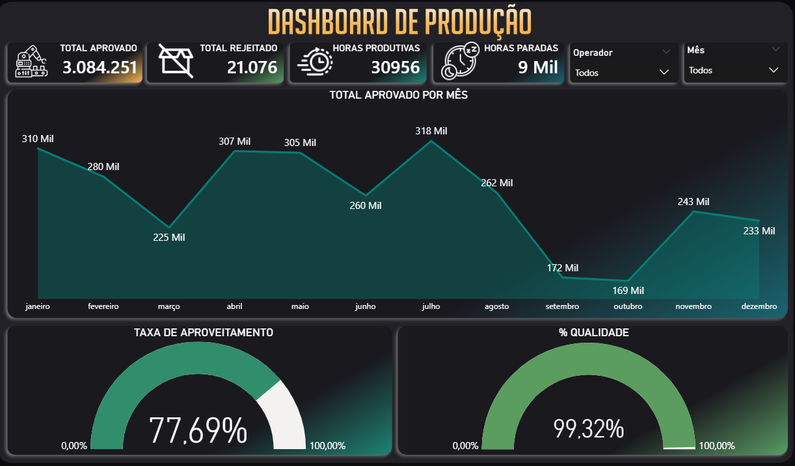
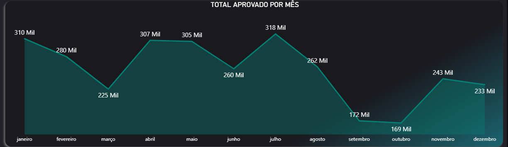
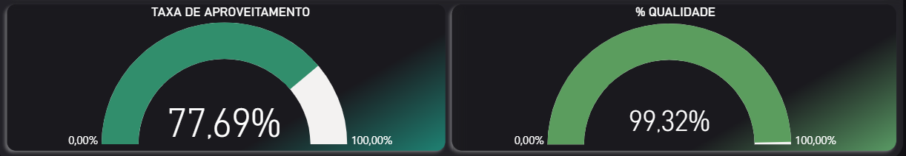

# powerbi_dashboard_producao
Data analysis project: Production dashboard built with Power BI.

# Dashboard de Produção - Power BI

Este projeto apresenta um dashboard de análise de produção desenvolvido no Power BI com o objetivo de visualizar indicadores operacionais e acompanhar o desempenho produtivo.

## Objetivo

O dashboard foi criado para facilitar a análise de dados de produção, permitindo identificar padrões, acompanhar volumes produzidos e observar tendências ao longo do tempo.

## Principais Indicadores

- Volume total de produção
- Produção por categoria de produto
- Tendência de produção ao longo do tempo
- Indicadores de desempenho operacional

## Ferramentas Utilizadas

- Power BI
- Microsoft Excel
- Técnicas de visualização de dados

## Base de Dados

Os dados utilizados neste projeto são **fictícios**, criados exclusivamente para fins de estudo e desenvolvimento de portfólio.

## Visualização do Dashboard

Visão geral do dashboard

Visão do topo do dashboard, com insights úteis e de fácil acesso, facilitando a análise.

Visão do meio do dashboard, com um gráfico de performance que torna a visibilidade do desempenho da empresa significativamente mais intuitiva.

Visão da base do dashboard, com gráficos que apresentam dados importantíssimos para a empresa em geral, como a taxa de aproveitamento de horas trabalhadas e o percentual de qualidade do produto.

## Arquivos do Projeto

- Dashboard em Power BI (.pbix)
- Base de dados em Excel (.xlsx)
- Imagens do dashboard

## Autor

Elisson Renner
